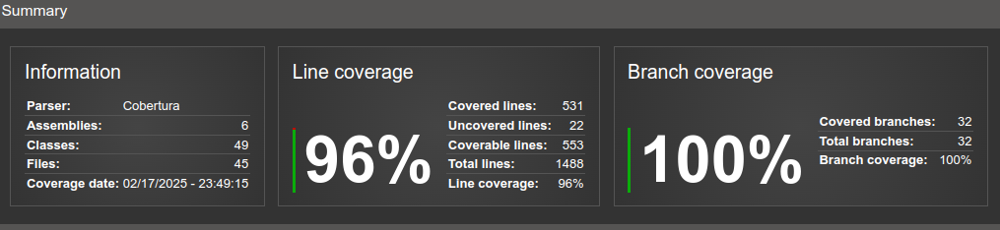

# snacktech-api-payment

## Descrição

Serviço API que lida com as features que envolvem pagamento dos pedidos da lanchonete

## Tecnologias Utilizadas

- **C#**: Linguagem de programação usada no desenvolvimento do projeto
- **.NET 8**: Framework como base em que a API é executada
- **MongoDB**: Base de dados para armazenar os dados trabalhados pela API em forma de documentos
- **Swagger**: Facilita a documentação da API
- **SQS**: Tecnologia de mensageria que permite comunicação assíncrona através do envio de mensagens a uma fila específica.
- **Docker**: Permite criar uma imagem do serviço e rodá-la em forma de contâiner

## Como Utilizar

### Pré-requisitos

Antes de rodar o projeto SnackTech, certifique-se de que você possui os seguintes pré-requisitos:

- **.NET SDK**: O projeto foi desenvolvido com o .NET SDK 8. Instale a versão necessária para garantir a compatibilidade com o código.
- **Docker**: O projeto utiliza Docker para contêinerizar a aplicação e o banco de dados. Instale o Docker Desktop para Windows ou Mac, ou configure o Docker Engine para Linux. O Docker Compose também é necessário para orquestrar os containers.
- **MongoDB (Opcional)**: O projeto tem um arquivo de docker-compose que configura e gerencia uma instância do MongoDB dentro de um container Docker. Sendo assim, a instalação ou uso de uma solução em nuvem é opcional.
- **AWS SQS (Opcional)**: A API faz uma comunicação assíncrona através do AWS SQS publicando notificações quando um pagamento foi realizado. O recebimento do pagamento é via Webhook com o Mercado Pago. O arquivo de docker-compose sobe um serviço de LocalStack onde é possível criar uma fila SQS para ser utilizada no lugar da AWS se desejado.

### Preparando o ambiente

O repositório tem um arquivo de Docker Compose que sobe toda a estrutura necessária para a API:

- Uma base de dados MongoDb
- Um Localstack onde é possível ter uma fila SQS

Depois de rodar o comando docker-compose up, necessário executar o comando para criar a fila SQS dentro do LocalStack:

`aws --endpoint-url=http://localhost:4566 sqs create-queue --queue-name snacktech-processed-payments`

Pode ser usado ese comando para ver a mensagem dentro da fila, porem o comando só retorna a primeira mensagem.:

 `aws --endpoint-url=http://localhost:4566 sqs receive-message     --queue-url http://localhost:4566/000000000000/snacktech-processed-payments`

### Uso

Este é um projeto desenvolvido em .NET, utilizando arquitetura Clean. A aplicação é um microsserviço focado em operações que envolvem o processo de pagamento. 
No momento o projeto utiliza somente a plataforma do MercadoPago e esse serviço funciona como uma interface para outros serviços dentro da estrutura possam focar 
em suas features e caso precise interagir com pagamento acionar esta API.

## Desenvolvimento

### Estrutura do Código

Todo o código fonte da aplicação fica dentro da pasta `src` e os projetos de testes dentro da pasta `tests`.

Cada módulo representa uma parte criada para atender o objetivo do serviço

#### api

O módulo que sobe a API do serviço de fato. Aqui fica a construção das controllers, a injeção de serviços, configuração de conexões, aplicação de HealthChecks, etc.

#### common

Um módulo focado em ter todo tipo de estrutura que seja de uso comum dentro dos módulos da aplicação. Classes de dados, Interfaces, classes para representar configurações, tudo consta aqui e permite que os módulos não fiquem acoplados entre si por precisar depender dessas estruturas

#### core

O núcleo da aplicação. Foi criado seguindo a arquitetura Clean Architecture, garantindo uma separação entre o exterior (gateways) com o coração do software (use-cases, domain)

#### driver.amazon.sqs

Módulo focado em se conectar ao serviço de SQS e fornece uma interface de comunicação com esse serviço. Seu foco é possibilitar produzir mensagens a uma fila configurada.

#### driver.database.mongo

Módulo com objetivo de se conectar a uma base de dados MongoDB e fornecer uma interface dentro da aplicação possibilitando escrever, buscar e editar os dados trabalhados pela aplicação

#### driver.mercado-pago

A aplicação faz uso da plataforma do Mercado Pago como processadora de pagamentos e esse módulo é o responsável por acessar a API do Mercado Pago para possibilitar a geração de cobranças que podem ser fornecidos aos usuários para que possam fazer os pagamentos de seus pedidos

### Tests

A aplicação conta com 2 projetos de testes.

`unit-tests` contem todo o conjunto de testes unitários construídos para garantir que cada unidade de código esteja operando como esperado dentro de cada respectivo contexto

`behavior-tests` contem os testes de BDD, criados usando Gherkin

### Modificabilidade

Para alterar o código da aplicação, recomendamos que faça um clone do repositório e crie uma branch própria partindo da branch development, para não perder últimas mudanças.

Após aplicar as alterações, abra um PR apontando para a branch development como destino e espere a aprovação. Uma vez aprovado a pipeline de CI/CD deve entrar em ação, passando o código pelo Sonar e gerando o artefato necessário para seguir com o deploy.

## Cobertura de testes automatizados

